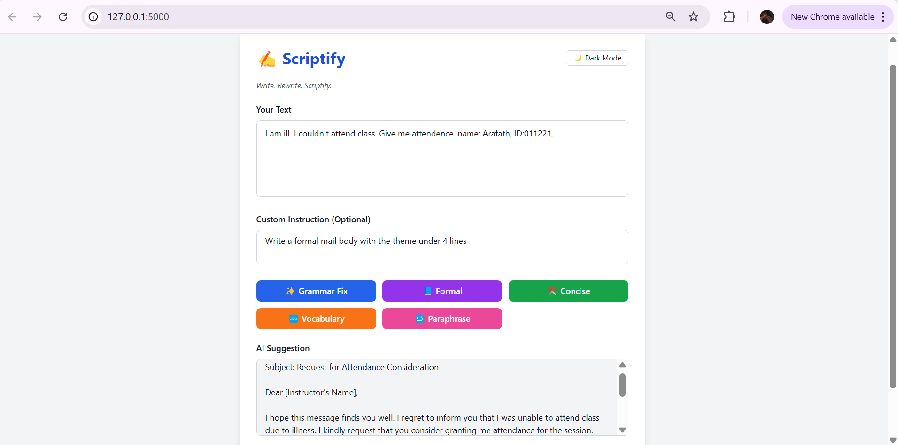

# **Scriptify** - Write. Rewrite. Scriptify.

**Scriptify** is an intelligent writing assistant powered by AI. Whether you're looking to fix grammar, paraphrase content, enhance style, or follow specific instructions — Scriptify lets you do it all with ease.  
From students to professionals, it’s built to boost productivity, creativity, and clarity in your writing.



---

## 💡 Features

- ✅ **Grammar Fixing** – Automatically correct grammatical errors.
- 🔁 **Paraphrasing** – Rephrase your text while preserving the original meaning.
- ✂️ **Concise Mode** – Make your content more direct and to the point.
- 📘 **Formal Style** – Adjust tone to make writing more formal.
- 🔤 **Vocabulary Improvement** – Enhance word choice for clarity and impact.
- 🧠 **Custom Instruction Mode** – Input any instruction (e.g., *Summarize in bullet points*, *Make it more persuasive*, etc.)
- 🌙 **Dark/Light Theme Toggle** – Beautiful and responsive UI with animated transitions.
- 📱 **Fully Mobile Responsive** – Smooth, accessible experience across all screen sizes.
- 💾 **Copy and Download Output** – Use the AI-generated content easily.


## ⚙️ Tech Stack

- **Backend**: Python, Flask, OpenAI API (GPT-4o-mini)
- **Frontend**: HTML, Tailwind CSS, Vanilla JavaScript
- **Others**: Dotenv for API key handling

---

## 🛠️ Local Setup

### 1. Clone the Repository

```bash
git clone https://github.com/ArafathUIU/scriptify-AI-Writing-Tool.git
cd scriptify

## 📄 License
This project is licensed under the MIT License. See the [LICENSE](LICENSE) file for details.

